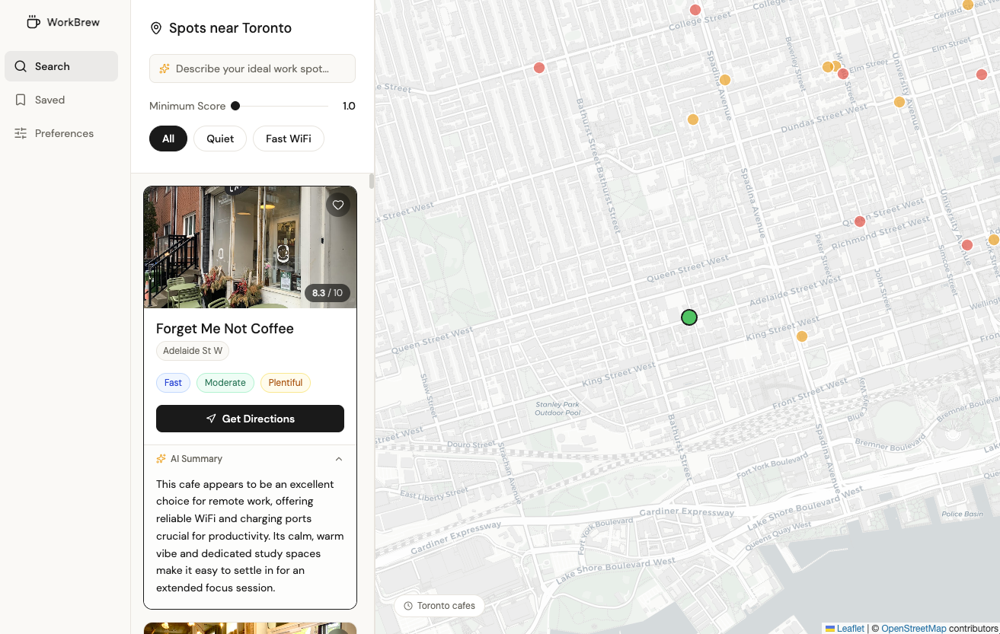

# WorkBrew

WorkBrew helps remote workers discover Toronto cafés that fit how they work. Browse spots on a map, filter by basics like Wi‑Fi and noise, save favourites, and use natural-language search—powered by your saved preferences—to get ranked picks with short explanations.



## Run locally with Docker

1. **Environment** — Copy `.env.example` to `.env` at the repo root. Set `POSTGRES_USER`, `POSTGRES_PASSWORD`, and `POSTGRES_DB` (defaults match Compose). Add a [Google AI Studio](https://aistudio.google.com/apikey) `GEMINI_API_KEY` for AI search and shop scoring.

2. **Start the stack** — From the project root:

   ```bash
   docker compose up --build
   ```

3. **Open the app** — Frontend: [http://localhost:3000](http://localhost:3000). API docs: [http://localhost:8000/docs](http://localhost:8000/docs). Postgres is exposed on host port `5433` if you need a local client.

Optional: with `GOOGLE_MAPS_API_KEY` you can run `python backend/seed.py` (café data) and `python backend/services/score_shops.py` (work profiles) against the same `DATABASE_URL` your backend uses.

## Architecture choices

The backend is the center of gravity for this project. All café data lives in Postgres — structured scores (`wifi_score`, `noise_score`, `outlet_score`, `longevity_score`, `focus_score`) stored in `work_profiles` alongside raw Google reviews in `shops`. That separation matters: the scoring pipeline (`score_shops.py`) is a one-time offline process that enriches the data before any user ever hits the app, so the live request path never blocks on expensive AI calls just to serve a café list. The frontend is deliberately thin — it reads from a single `GET /api/spots` endpoint and holds user preferences in `localStorage`, which keeps the backend stateless and the architecture easy to scale or swap out layer by layer.

## What I focused on: the data and AI layer

The area I invested most in was making the AI recommendation both cheaper and more honest. The raw problem: sending 50 cafés worth of Google reviews verbatim to Gemini would be expensive, slow, and full of noise (complaints about service, food, parking — none of it relevant to remote work). The fix lives in `backend/services/reviews.py`. Before any Gemini call, `prepare_reviews_for_prompt` uses pandas to filter review lines to only those containing work-relevant terms (Wi‑Fi, outlets, noise, focus, laptop, and similar), appends at most two unmatched lines for context, then truncates each to 200 characters. The result cuts token usage significantly while keeping the signal the model actually needs.

On the prompt side, the recommend endpoint injects a structured `USER PROFILE` block — work style, noise preference, session length, must-haves — and instructs the model to weight the profile first, then refine by the specific query. This means the same question returns different results for different users. Off-topic requests are caught at the model level (the prompt instructs a structured `off_topic` flag) rather than with brittle keyword filters, keeping the logic clean. Together these choices reduced prompt size, improved ranking consistency, and made the cost-per-request predictable enough for a shared app.

## How I leveraged AI — inside the app and to build it

**Inside the app**, AI does two distinct jobs. The offline scoring pipeline (`score_shops.py`) sends each café's raw Google reviews to Gemini and asks it to produce structured scores — wifi, noise, outlets, longevity, focus — plus a one-sentence work summary and `best_for` / `avoid_if` tags. This runs once and the results are stored in Postgres, so every user gets pre-computed AI summaries without paying inference cost at request time. The live AI feature is the recommendation endpoint: it takes the user's natural-language query, merges it with their saved work profile, and asks Gemini to rank the top 5 cafés from the scored dataset with a one-sentence explanation per result. Because the profile is injected into every prompt, the same question returns different answers for different users.

**To build the app**, I used Claude Code throughout — planning the architecture, writing and refactoring backend services, debugging the scoring pipeline, and testing the API. My role was directing the work, reviewing every output, and making the judgment calls on what to keep, cut, or redo. The design system was generated using Magic Patterns and stored in `.claude/CLAUDE.md` so that Claude Code could reference it consistently across every component — colours, spacing, typography, and component rules — without needing to re-specify it each time.

## Trade-offs and judgment calls

**localStorage over a users table.** User preferences and saved spots are stored in the browser rather than in Postgres. The honest reason is time: building auth, a sessions table, and a login flow would have consumed most of the 8 hours and left little room for the data and AI layers that are the actual differentiator. The cost is that preferences don't roam across devices. For a local prototype targeting a single user, that's an acceptable cut — but it's the first thing to revisit before a real launch.

**One global Gemini client with a 4-second cooldown.** Rather than per-user request queuing or a token bucket, the recommend endpoint uses a single in-process lock and a minimum gap between Gemini calls. This is simple and prevents the most obvious cost abuse, but it serialises all recommendation requests globally — two users hitting the endpoint at the same time means one waits. For a shared production deployment the right solution is a proper per-IP rate limiter backed by Redis, but for a local single-user prototype the tradeoff is worth the reduced complexity.

The biggest gap right now is that the app answers "where should I work?" but not "should I go there _today_?" With more time the priorities would be:

- **Deploy the project** — containerized stack is already Docker Compose ready; the next step is a cloud host (Railway, Fly.io, or a VPS) with a managed Postgres instance so the app is publicly accessible and always-on rather than local-only.
- **Open now + live hours** — surface whether a café is currently open and how busy it typically is at this hour using Google Popular Times data. This is the single change that most unblocks basic trust in the app; without it users still have to verify the answer elsewhere.
- **Intent-based quick picks** — a one-tap row at the top of the UI (`Deep focus`, `Video calls`, `Quick hour`) that instantly returns a ranked shortlist based on saved preferences. Removes the friction of typing a query for the daily use case.
- **Session log + productivity rating** — let users record where they worked and rate the session 1–5. Over time the app can surface patterns ("you’re most productive at Pilot on weekday mornings") and create a habit loop that brings people back daily.
- **Check-in / crowdsourced conditions** — a lightweight "I’m here now" flow where users report current noise, seat availability, and Wi‑Fi status (auto-expires after 2 hours). Even a small number of active users makes this data genuinely irreplaceable and creates the network effect that no static dataset can replicate.
